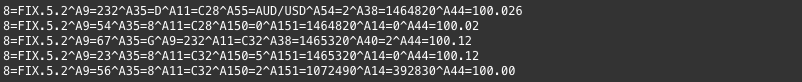
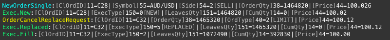

# What is fixgrep?
fixgrep is a command line utility for searching through, and making FIX protocol messages more readable.
fixgrep can turn this:

into this:

## Features
* Filtering of messages by field criteria
* Hide 'un-interesting' tags
* Change the order that tags are displayed
* Highlight tags and lines based on criteria
* Output to text or html format

# How to get
Download the latest version from [here](https://github.com/tools4j/fixgrep/tree/master/fixgrep-core/releases)

# How to get help
Please visit the fixgrep home page [https://tools4j.github.io/fixgrep/index.html](https://tools4j.github.io/fixgrep/index.html) for detailed help and information.
Alternatively:
* Running 'fixgrep man online' (no dashes) will open the above home page in your default browser.
* Running 'fixgrep man' (no dashes) will display the fixgrep man page.
* Running 'fixgrep --man' (with dashes) will display the fixgrep man page without scrolling.
* Running 'fixgrep -?' will print a list of options.
